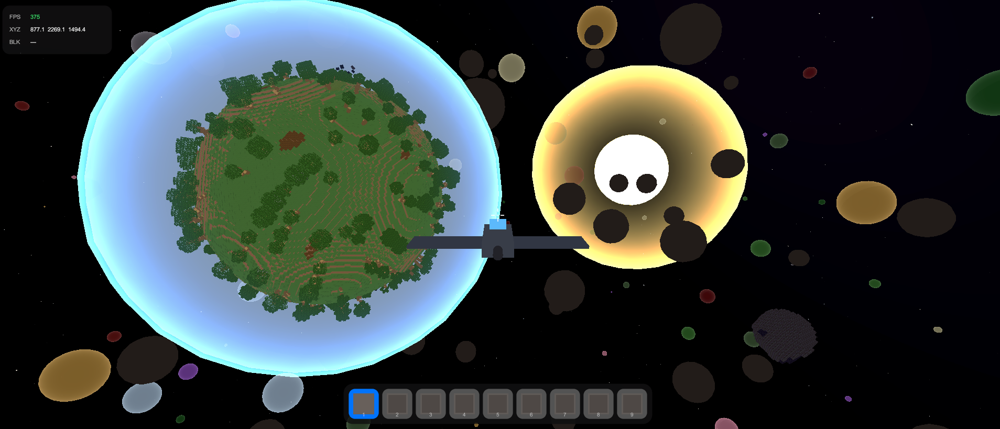
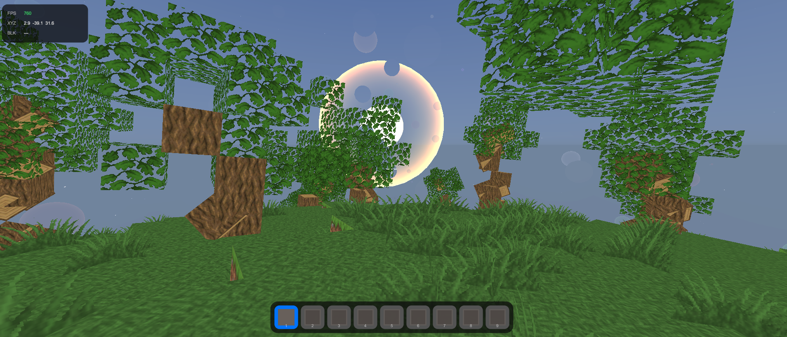
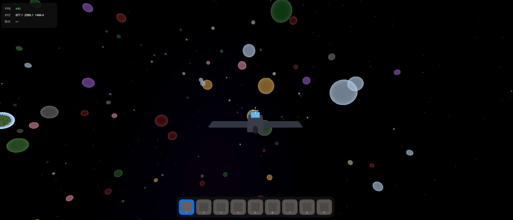

# AstroVoxel

> **Jeu de voxels spatial multijoueur** — Explorez des planètes procédurales, pilotez des vaisseaux, craftez des outils et combattez des IA ennemies dans un système solaire infini généré par seed.



---

## Table des matières

1. [Aperçu du projet](#aperçu-du-projet)
2. [Lancer le projet Unity (Bootstrap)](#lancer-le-projet-unity-bootstrap)
3. [Architecture technique](#architecture-technique)
4. [Fonctionnalités détaillées](#fonctionnalités-détaillées)
   - [Moteur Voxel — Planètes 18 Faces](#moteur-voxel--planètes-18-faces)
   - [Système de planètes infinies](#système-de-planètes-infinies)
   - [Biomes procéduraux](#biomes-procéduraux)
   - [Joueur & Déplacement](#joueur--déplacement)
   - [Modes de jeu — Créatif & Survie](#modes-de-jeu--créatif--survie)
   - [Inventaire & Crafting](#inventaire--crafting)
   - [Vaisseau spatial](#vaisseau-spatial)
   - [Craft du Starship](#craft-du-starship)
   - [Propulseur](#propulseur)
   - [IA ennemies](#ia-ennemies)
   - [Astéroïdes & Météorites](#astéroïdes--météorites)
   - [Atmosphère & Cycle jour/nuit](#atmosphère--cycle-journuit)
   - [Système de sauvegarde](#système-de-sauvegarde)
   - [Console en jeu](#console-en-jeu)
   - [Menu Principal](#menu-principal)
   - [Menu Pause](#menu-pause)
   - [Multijoueur](#multijoueur)
5. [Contrôles complets](#contrôles-complets)
6. [Commandes console](#commandes-console)
7. [Structure du projet](#structure-du-projet)
8. [Assets utilisés](#assets-utilisés)

---

## Aperçu du projet

AstroVoxel est un jeu Unity développé en C# autour d'un moteur de voxels sphérique original. Chaque monde est une planète-sphère entourée d'un système solaire avec **512 planètes procédurales**, trois anneaux d'astéroïdes et un soleil en orbite. Le jeu supporte le **multijoueur LAN/réseau** via Unity Netcode for GameObjects (NGO).

| Caractéristique | Valeur |
|---|---|
| Moteur | Unity (URP) |
| Langage | C# |
| Réseau | Unity Netcode for GameObjects + Unity Transport |
| Rendu | Universal Render Pipeline |
| Géométrie planétaire | Cube-sphère octaédrique 18 faces |
| Taille d'un chunk | 16 × 16 × 16 blocs |
| Planètes dans le système | 512 |
| Biomes | 11 |



---

## Lancer le projet Unity (Bootstrap)

### Prérequis

- **Unity 6** (ou la version indiquée dans `ProjectSettings/ProjectVersion.txt`)
- Package **Unity Netcode for GameObjects** (inclus dans `Packages/manifest.json`)
- Package **Unity Transport (UTP)**
- Render Pipeline **Universal Render Pipeline (URP)**

### Étapes d'installation

```bash
# Cloner le dépôt
git clone <url-du-repo> AstroVoxel
cd AstroVoxel

# Ouvrir dans Unity Hub → "Open project from disk"
# Sélectionner le dossier AstroVoxel/
```

### Configuration du script Bootstrap

> `GameBootstrap.cs` est **le seul MonoBehaviour à placer manuellement** dans la scène. Il construit toute la hiérarchie par code.

1. Ouvrir la scène principale dans `Assets/_Scenes/`
2. Créer un **GameObject vide** nommé `Bootstrap`
3. Attacher le composant `GameBootstrap` à ce GameObject
4. Configurer les paramètres dans l'**Inspector** :

| Paramètre | Défaut | Description |
|---|---|---|
| `planetRadius` | `60` | Rayon de la planète de départ en unités Unity |
| `playerHeight` | `1.8` | Hauteur de la capsule joueur |
| `playerRadius` | `0.4` | Rayon de la capsule joueur |
| `spawnAltitude` | `10` | Hauteur de spawn au-dessus de la surface (blocs) |
| `_skipMenu` | `false` | **Cocher pour bypasser le menu principal** (dev) |

5. Appuyer sur **Play**


### Flux de démarrage détaillé

```
GameBootstrap.Awake()
  │
  ├─ BuildNetworkManager()          ← réseau initialisé en premier
  │
  ├─ _skipMenu == true ? ──────────────────────► StartWorld()
  │                                                    │
  └─ MainMenu.Show() ─────► OnMenuResult(result)       │
         │                       │                     │
         │  (load save)          ├─ SaveSystem.LoadWorldStatic()
         │                       │    └─ SceneManager.LoadScene()  [reload]
         │                       │         └─ Awake() → StartWorld()
         │  (nouveau monde)      │
         │                       └─ WorldSeedManager.GenerateNewSeed()
         │                            └─► StartWorld()
         │
StartWorld()
  ├─ BuildEnvironment()             ← skybox spatiale
  ├─ BuildSun()                     ← soleil orbital
  ├─ BuildPlanet()                  ← planète voxel 18 faces
  ├─ BuildPlayer()                  ← joueur + caméra + HUD
  ├─ BuildAtmosphere()              ← sphère ciel + ozone + brouillard
  ├─ BuildSpaceShip()               ← vaisseau spatial de départ
  ├─ BuildStarshipCrafter()         ← détecteur de pattern de craft
  ├─ BuildAsteroidSystem()          ← 3 champs d'astéroïdes + météorites
  ├─ BuildInfinitePlanets()         ← système de 512 planètes
  ├─ BuildSaveSystem()              ← charge la save en attente si /load
  └─ BuildNetworkComponents()       ← câblage réseau (BlockSync, EnemySync…)
```

---

## Architecture technique

AstroVoxel est **entièrement construit par code** : zéro prefab. Le script `GameBootstrap` assemble la scène complète au démarrage. Cela permet une reproductibilité totale à partir d'une seed.

### Patterns de conception utilisés

| Pattern | Classe(s) concernée(s) |
|---|---|
| **Singleton** | `ServerManager`, `BlockSyncManager`, `SaveSystem`, `AsteroidSystemManager` |
| **Builder** | `GameBootstrap`, `HudBuilder` |
| **Factory** | `AsteroidField.CreateAsteroid()`, `Scoreboard.Create()` |
| **Registry** | `PlayerNetworkSync._registry` (lookup par clientId) |
| **Strategy / Interface** | `IVoxelWorld` → `PlanetWorld`, `AsteroidWorld` |
| **Observer / Events** | `BlockInteraction.OnBlockPlaced`, `GameModeManager.OnGameModeChanged` |
| **State Machine** | `EnemySpaceShipController` (Patrol/Chase/Attack/Evade) |
| **Flyweight / Struct** | `BlockChangeData` (20 octets), `PlanetGenerationConfig` |
| **Command** | `GameConsole` (/save, /load, /server…) |

---

## Fonctionnalités détaillées

### Moteur Voxel — Planètes 18 Faces

AstroVoxel utilise une géométrie **Cube-Sphère Octaédrique à 18 faces** qui garantit une couverture complète de la sphère sans artefacts aux coins de cube classiques.

- Chaque chunk est un cube `16×16×16` blocs orienté radialement par rapport au centre de la planète
- Les blocs sont donc toujours **perpendiculaires à la surface** : pas d'effet escalier sur les sphères
- Le chargement initial est **synchrone** (la physique se synchronise avant le premier FixedUpdate) pour éviter que le joueur tombe à travers la planète
- Plus de **90 types de blocs** définis dans `BlockType` (Air, Stone, Dirt, Grass, Obsidian, DiamondBlock, Deepslate, etc.)


#### Types de blocs (sélection)

| Catégorie | Blocs |
|---|---|
| **Naturels** | Stone, Dirt, Grass, Sand, Cobblestone, Gravel |
| **Bois** | OakLog, SpruceLog, BirchLog, JungleLog, AcaciaLog, DarkOakLog, CherryLog |
| **Feuillages** | OakLeaves, SpruceLeaves, BirchLeaves, JungleLeaves, CherryLeaves |
| **Pierre spéciale** | Deepslate, Granite, Andesite, Diorite, Blackstone, Endstone |
| **Nether** | Netherrack, SoulSand, Glowstone, NetherBrick |
| **Rares** | DiamondOre, DiamondBlock, GoldOre, Obsidian, PurpurBlock, QuartzBricks |
| **Craftés** | CraftingTable, Planches ×6 essences |
| **Spéciaux** | Ice, BlueIce, PackedIce, MushroomStem, Cactus, BambooBlock |

---

### Système de planètes infinies



Le système `InfinitePlanetSystem` gère **512 planètes** dans le système solaire :

- **Distance > 80 000 u** : planètes non affichées (culling)
- **Distance ≤ 80 000 u** : rendu en **impostor sphérique** via `Graphics.DrawMesh` — zéro GameObject, zéro GC, couleur basée sur le biome
- **Distance ≤ rayon + 600 u** : chargement voxel **asynchrone** (6 chunks par frame pour éviter les gels)
- **Distance > rayon + 900 u** : déchargement des voxels (hystérésis pour éviter les oscillations)

Les positions sont calculées une seule fois à l'initialisation via la `WorldSeedManager` : zéro allocation au runtime.

---

### Biomes procéduraux

Chaque planète se voit assigner un biome qui définit ses blocs de surface, ses arbres, ses grottes et son amplitude de relief.

| Biome | Couleur impostor | Surface | Particularités |
|---|---|---|---|
| **Terran** | Vert | Herbe / Terre | Arbres normaux, grottes |
| **Desert** | Sable | Sable / Grès / RedSand | Pas d'arbres, dunes |
| **Snow** | Blanc bleuté | PackedIce / Pierre / BlueIce | Épicéas rares |
| **Volcanic** | Rouge sombre | Netherrack / Blackstone / Obsidian | Cratères |
| **Forest** | Vert foncé | JungleLog / JungleLeaves | Forêt dense |
| **Mountain** | Gris | Granite / Andesite | Amplitude maximale |
| **Endstone** | Beige | EndStone / PurpurBlock | Planète End |
| **Crystal** | Violet | QuartzBricks / PurpurBlock / Deepslate | Cristallin |
| **Nether** | Rouge-brun | SoulSand / Netherrack / Glowstone | Nether |
| **Cherry** | Rose | CherryLog / CherryLeaves / Grass | Cerisiers |
| **Mossy** | Vert mousse | MossyCobblestone / DarkOak | Vieux et mystérieux |

[SCREEN: biome Volcanic avec roche noire, Netherrack et ambiance rouge sombre]

[SCREEN: biome Cherry avec cerisiers roses et herbe verte]

[SCREEN: biome Crystal avec formations de quartz violettes]

---

### Joueur & Déplacement

Le joueur est une capsule physique (Rigidbody + CapsuleCollider) avec gravité radiale par rapport au centre de la planète la plus proche.

- **ZQSD / WASD** — déplacement horizontal
- **Sprint** (Shift gauche) — vitesse ×1.64
- **Accroupi** (Ctrl gauche) — vitesse ×0.4, hauteur réduite à 60 %
- **Saut** (Espace) — Minecraft-calibré : hauteur max ~1.25 bloc, apex à ~0.43 s
- **Coyote time** 120 ms — saut bufferisé après le bord d'une plateforme
- **Auto-saut step-up** — monte automatiquement les blocs d'une hauteur de 1 bloc
- **Gravité radiale** — le joueur s'aligne toujours sur la surface de la planète courante, y compris sur les astéroïdes

[SCREEN: joueur en train de creuser un bloc avec l'interface HUD visible (hotbar, vie, coordonnées)]

#### HUD en jeu

Le HUD est construit entièrement par code (`HudBuilder`) et affiche :
- **Barre de vie** (mode Survie) — 10 cœurs = 20 HP
- **Hotbar** — 9 slots d'items
- **Réticule** central
- **FPS** + **coordonnées XYZ** du joueur (coin supérieur gauche)
- **Type de bloc** pointé
- **Indicateur de cooldown** du Propulseur

---

### Modes de jeu — Créatif & Survie

Le mode est choisi à la création du monde et peut être modifié via la console.

#### Mode Créatif
- Vie infinie, pas de dégâts
- **Inventaire créatif** (touche `E`) — accès à tous les blocs, recherche par nom
- Placement et destruction instantanés
- Propulseur toujours disponible depuis l'inventaire créatif

#### Mode Survie
- **20 HP** (10 cœurs), régénération naturelle +1 HP toutes les 4 secondes
- **Dégâts de chute** : au-dessus de 3 blocs, 1 HP par bloc supplémentaire
- **Mort** → écran de mort avec raison de décès, puis respawn
- Les outils ont un effet sur la vitesse de minage (pioche, hache, pelle)
- Ressources à collecter, crafting requis

[SCREEN: écran de mort en mode Survie avec le message de raison]

[SCREEN: inventaire de survie ouvert avec les slots de craft 2×2 et les recettes disponibles]

---

### Inventaire & Crafting

#### Inventaire Survie (touche `E`)

- **9 slots hotbar** + **inventaire 3×9** = 36 slots
- **Grille de craft 2×2** intégrée à l'inventaire (recettes sans établi)
- **Grille de craft 3×3** nécessite un **Établi** (bloc craftable)
- Les items s'empilent jusqu'à 64

#### Recettes disponibles

| Résultat | Ingrédients | Établi requis |
|---|---|---|
| 4× Planches (×6 essences) | 1× Bûche correspondante | Non |
| 4× Bâtons | 2× Planches de Chêne | Non |
| 1× Établi | 4× Planches de Chêne | Non |
| 1× Pioche en Bois | 3× Planches + 2× Bâtons | Oui |
| 1× Pioche en Pierre | 3× Cobblestone + 2× Bâtons | Oui |
| 1× Hache en Bois | 3× Planches + 2× Bâtons | Oui |
| 1× Hache en Pierre | 3× Cobblestone + 2× Bâtons | Oui |
| 1× Pelle en Bois | 1× Planche + 2× Bâtons | Oui |
| 1× Pelle en Pierre | 1× Cobblestone + 2× Bâtons | Oui |
| 1× **Propulseur** | 3× Blackstone + 2× Bâtons | Oui |

[SCREEN: interface de l'établi avec la grille 3×3 et les recettes affichées]

---

### Vaisseau spatial

[SCREEN: vaisseau spatial en vol au-dessus d'une planète — vue extérieure depuis la caméra 3e personne]

Le vaisseau est un véhicule **6DOF** (six degrés de liberté) avec deux modes physiques distincts.

#### Physique spatiale
- Inertie newtonienne pure (traînée linéaire = 0)
- Conserve la vitesse sans input (pas de frein automatique sauf Flight Assist)

#### Physique atmosphérique
- Gravité planétaire appliquée manuellement
- Traînée atmosphérique active (résistance de l'air)
- Basculement automatique au passage de l'OzoneLayer

#### Contrôles vaisseau

| Touche | Action |
|---|---|
| `W` / `Z` | Poussée avant |
| `S` | Frein / poussée arrière |
| `Q` | Roulis gauche |
| `E` | Roulis droite |
| `A` | Dérive gauche |
| `D` | Dérive droite |
| `Espace` | Poussée haut (local) |
| `Ctrl gauche` | Poussée bas (local) |
| `Shift gauche` | **Boost** ×3 |
| `Souris X/Y` | Lacet / Tangage |
| `← / →` | Lacet clavier |
| `↑ / ↓` | Tangage clavier |
| `Tab` | Toggle Flight Assist |
| `F` | Embarquer / Débarquer |

#### Armement
- Tir laser (clic gauche en pilotant)
- Dégâts : 15 HP par tir sur les vaisseaux ennemis
- Cooldown : 0.5 s

#### Crash en mode Survie
- Impact à ≥ 100 m/s → explosion du vaisseau et mort du joueur

[SCREEN: vue cockpit depuis l'intérieur du vaisseau avec les étoiles en fond]

---

### Craft du Starship

Il est possible de **créer un nouveau vaisseau** en disposant des blocs selon un pattern spécifique :

```
O O O O O O    ← 6 blocs de profondeur (Obsidiane)
O O O O O O    ← 3 blocs de large
O O O O O O

   [D]          ← 1 DiamondBlock, 1 case devant le centre du pattern
```

- Pose le bloc **DiamondBlock** en dernier pour déclencher le craft
- Fonctionne sur toute `IVoxelWorld` (planète, astéroïde, planète infinie)
- Synchronisé en multijoueur via le canal `av.ship_craft`

[SCREEN: pattern d'obsidienne + diamant au sol avant le craft, puis vaisseau qui apparaît]

---

### Propulseur

Item spécial craftable en mode Survie, utilisable en Créatif depuis l'inventaire.

- **Clic droit** sur un point de la surface → propulsion vers cette cible à 42 m/s
- Portée maximale : 400 unités
- Cooldown : 2 secondes
- Fonctionne aussi dans l'espace (vers un astéroïde, une paroi, etc.)

[SCREEN: joueur propulsé en arc de parabole entre deux reliefs planétaires]

---

### IA ennemies

[SCREEN: vaisseau ennemi rouge en approche depuis l'espace, missiles visibles]

Les vaisseaux ennemis sont des UAP rouges pilotés par une **machine à états à 4 phases** :

```
PATROL ──(joueur détecté < 800u)──► CHASE
                                         │
                              (joueur < 400u)──► ATTACK ──► tir missiles toutes les 3s
                                         │
                              (obstacle imminent)──► EVADE ──► retour CHASE/PATROL
```

| État | Comportement |
|---|---|
| **Patrol** | Vol libre dans un rayon de 2 800 u autour du centre |
| **Chase** | Fonce vers le joueur à 160 m/s max |
| **Attack** | Tire des missiles à distance ≤ 400 u |
| **Evade** | Esquive obstacles (planètes, astéroïdes) |

- **100 HP** par vaisseau ennemi
- L'IA ne tourne que sur le **host** en multijoueur ; les clients reçoivent les positions à 20 Hz via `EnemySyncManager`
- Missiles synchronisés séparément à 10 Hz

---

### Astéroïdes & Météorites

Le système `AsteroidSystemManager` crée **3 champs d'astéroïdes concentriques** autour de la planète :

| Champ | Orbite interne | Orbite externe | Nombre |
|---|---|---|---|
| Close Belt | ~120 u | ~200 u | Variable |
| Main Belt | — | — | Variable |
| Outer Belt | — | — | Variable |

Chaque astéroïde possède :
- **Mouvement orbital** + tumble aléatoire (`AsteroidOrbit`)
- **Micro-gravité** surfacique (`GravityAttractor`) — le joueur peut marcher dessus
- **Monde voxel** complet (`AsteroidWorld`) — minable, construisable
- **LOD automatique** (`AsteroidLOD`) : voxels chargés quand le joueur s'approche, impostor sinon
- Budget global : **4 astéroïdes maximum** en mode voxel simultanément (éviction par distance)

Des **météorites** tombent périodiquement sur la planète (`MeteoriteSpawner`).

[SCREEN: champ d'astéroïdes en orbite avec un astéroïde en voxels au premier plan et des impostors en fond]

[SCREEN: joueur marchant sur la surface d'un astéroïde avec la planète visible en arrière-plan]

---

### Atmosphère & Cycle jour/nuit

`AtmosphereRenderer` pilote l'aspect visuel de l'atmosphère :

- **Sphère de ciel** avec gradient zénith/horizon interpolé selon la position du soleil
- **Anneau ozone** visuel
- **Brouillard atmosphérique** exponentiel (désactivé dans l'espace)
- **Ambiance lumineuse** dynamique : jour (blanc-bleu) → golden hour (ambre) → nuit (quasi-noir)
- **Cycle jour/nuit** piloté par `SunOrbit` — le soleil orbite autour de la planète

En quittant l'atmosphère (passage de l'OzoneLayer) :
- Le brouillard disparaît
- L'ambiance devient celle de l'espace (très sombre)
- La physique du vaisseau bascule en mode spatial

[SCREEN: coucher de soleil depuis la surface — ciel orangé, horizon courbé, étoiles commençant à apparaître]

[SCREEN: vue depuis l'espace — planète avec son halo atmosphérique bleu visible]

---

### Système de sauvegarde

Les sauvegardes sont des fichiers **JSON** stockés localement, gérables entièrement via la [console en jeu](#console-en-jeu).

#### Ce qui est sauvegardé

| Élément | Détail |
|---|---|
| **Seed du monde** | Garantit la reproductibilité des planètes |
| **Modifications de blocs** | Home planet + toutes les planètes infinies visitées |
| **Position du joueur** | Coordonnées + rotation |
| **Position des astéroïdes** | Angle orbital de chaque astéroïde |
| **Modifications voxel astéroïdes** | Blocs placés/détruits sur les astéroïdes |
| **Vaisseaux** | Position et état de chaque vaisseau |

#### Flux de chargement

```
/load NOM
  └─ ForceInitialize(seed)            ← seed fixée AVANT reload de scène
  └─ PendingLoad = data               ← données en attente (static)
  └─ SceneManager.LoadScene()
       └─ GameBootstrap.Awake()
            └─ PendingLoad != null → StartWorld() directement
                 └─ SaveSystem.ApplyPendingLoad()
                      ├─ Home planet  → mods appliquées immédiatement
                      ├─ Planètes inf. → stockées dans InfinitePlanetSystem
                      ├─ Astéroïdes   → angle orbital restauré + mods queued
                      └─ Joueur       → position restaurée après 2 frames (physique stable)
```

---

### Console en jeu

> Ouvrir : **`T`** ou **`/`** | Fermer : **`Échap`** | Historique : **`↑` / `↓`**

Interface style terminal avec palette Apple Dark, animation de slide/fade à l'ouverture.

[SCREEN: console ouverte avec quelques commandes visibles — thème sombre Apple style]

Voir la liste complète des commandes dans la section [Commandes console](#commandes-console).

---

### Menu Principal

[SCREEN: menu principal — fond sombre, logo AstroVoxel, boutons Jouer / Créer un monde / Multijoueur]

Le menu principal est construit par code avec une **palette Apple Dark** et des animations de transition entre les panneaux.

#### Panneau "Jouer"
- Liste des sauvegardes existantes sous forme de cartes
- Sélection d'une save → boutons **Jouer**, **Jouer en multijoueur**, **Supprimer**

[SCREEN: panneau de sélection des saves avec les cartes de monde]

#### Panneau "Créer un monde"
- Champ **Nom** du monde
- Champ **Seed** custom (optionnel — aléatoire si vide)
- Toggle **Mode de jeu** : Créatif / Survie
- Toggle **Multijoueur** : active l'hébergement auto au démarrage

[SCREEN: panneau de création de monde avec les champs Nom, Seed et les toggles]

#### Panneau "Multijoueur"
- Champ **Code de connexion** (10 caractères base36)
- Bouton **Rejoindre**
- Accessible depuis "Jouer" (save existante) ou "Créer" (nouveau monde)

#### Bypass développeur
Cocher `_skipMenu` dans le composant `GameBootstrap` dans l'Inspector pour démarrer directement en jeu sans menu (utile pendant le développement).

---

### Menu Pause

> Ouvrir : **`Échap`** (quand aucun autre overlay n'est ouvert)

Overlay semi-transparent avec trois boutons :

| Bouton | Action |
|---|---|
| **Reprendre** | Ferme le menu, reprend le jeu |
| **Menu principal** | Retour au menu (reload de scène) |
| **Quitter** | Ferme l'application |

Note : en multijoueur, le temps ne se fige pas à la pause pour éviter la désynchronisation réseau.

---

### Multijoueur

[SCREEN: deux joueurs avec leurs avatars mannequin et nametags sur la même planète]

AstroVoxel utilise **Unity Netcode for GameObjects (NGO)** avec **Unity Transport (UTP)** sur le port **7777 UDP**.

#### Connexion

1. **Héberger** : `/server host` → génère un code de 10 caractères (copié dans le presse-papier)
2. **Rejoindre** : `/server join XXXXXXXXXX` → le code encode l'IP + port en base36

Le code peut aussi être saisi directement dans le **menu principal** (panneau Multijoueur).

#### Synchronisation

| Système | Fréquence | Canal | Fiabilité |
|---|---|---|---|
| Seed du monde | 1× à la connexion | `av.seed` | ReliableSequenced |
| Modifications de blocs | 20 Hz (batches 32 max) | `av.blocks` | ReliableSequenced |
| Position joueur | 10 Hz | `av.player_pos` | Unreliable |
| Position vaisseau | 20 Hz | `av.ship_pos` | Unreliable |
| Ennemis | 20 Hz | `av.enemy_batch` | Unreliable |
| Missiles | 10 Hz | `av.missile_batch` | Unreliable |
| Spawn/destroy | événementiel | multiples | Reliable |

#### Avatars distants

Les autres joueurs sont représentés par des **mannequins** style Minecraft :
- Corps cubique avec proportions Minecraft
- Tête qui suit le pitch caméra
- Corps avec lag naturel sur la rotation yaw
- Animation marche/course
- **Nametag** affiché au-dessus

#### Architecture réseau

```
ServerManager (Singleton)
    │
    └── CustomMessagingManager (canaux av.*)
             │
     ┌───────┼───────┬────────────┐
     │       │       │            │
 BlockSync PlayerNet ShipNetwork EnemySync
 Manager    Sync     (ServerMgr)  Manager
```

---

## Contrôles complets

### Joueur à pied

| Touche | Action |
|---|---|
| `Z` / `W` | Avancer |
| `S` | Reculer |
| `Q` / `A` | Strafe gauche |
| `D` | Strafe droite |
| `Shift gauche` | Sprint |
| `Ctrl gauche` | S'accroupir |
| `Espace` | Sauter |
| `E` | Ouvrir inventaire (Survie) / Inventaire créatif |
| `1`–`9` | Sélectionner slot hotbar |
| `Molette souris` | Changer slot hotbar |
| `Clic gauche` | Détruire un bloc |
| `Clic droit` | Placer un bloc |
| `Clic droit` (Propulseur) | Se propulser |
| `F` | Embarquer dans le vaisseau à proximité |
| `T` ou `/` | Ouvrir la console |
| `Échap` | Menu pause |

### Vaisseau spatial

| Touche | Action |
|---|---|
| `Z` / `W` | Poussée avant |
| `S` | Frein / poussée arrière |
| `Q` | Roulis gauche |
| `E` | Roulis droite |
| `A` | Dérive gauche |
| `D` | Dérive droite |
| `Espace` | Poussée haut |
| `Ctrl gauche` | Poussée bas |
| `Shift gauche` | Boost ×3 |
| `Souris` | Lacet + Tangage |
| `← / →` | Lacet clavier |
| `↑ / ↓` | Tangage clavier |
| `Tab` | Toggle Flight Assist |
| `Clic gauche` | Tirer (laser) |
| `F` | Débarquer |

---

## Commandes console

> Ouvrir la console avec `T` ou `/`

| Commande | Description |
|---|---|
| `/help` | Affiche toutes les commandes disponibles |
| `/save NOM` | Sauvegarde le monde sous le nom NOM |
| `/load NOM` | Charge la sauvegarde NOM (recharge la scène) |
| `/saves` | Liste toutes les sauvegardes disponibles |
| `/saves delete NOM` | Supprime la sauvegarde NOM |
| `/saves folder` | Ouvre le dossier des sauvegardes dans l'explorateur |
| `/server host` | Démarre un serveur et affiche le code de connexion |
| `/server join CODE` | Rejoint un serveur à l'aide du code (10 chars) |
| `/server stop` | Se déconnecte du réseau |
| `/restart` | Redémarre avec une nouvelle seed aléatoire |
| `/clear` | Vide tous les blocs de la hotbar |

---

## Structure du projet

```
Assets/
├── _Scripts/
│   ├── Bootstrap/          # GameBootstrap, MainMenu, PauseMenu
│   ├── VoxelEngine/        # PlanetWorld, ChunkData, BlockType, PlanetBiome…
│   ├── Space/              # InfinitePlanetSystem, AsteroidField, EnemySpawner…
│   ├── Player/             # PlayerController, PlayerHealth, CraftingSystem, HUD…
│   ├── Vehicle/            # SpaceShipController, EnemySpaceShipController…
│   ├── Environment/        # AtmosphereRenderer, SpaceSkyboxController, SunOrbit
│   ├── Physics/            # GravityAttractor, GravityBody, OzoneLayer
│   ├── Network/            # ServerManager, BlockSyncManager, PlayerNetworkSync…
│   └── Save/               # SaveSystem, WorldSaveData
├── _Materials/             # Matériaux blocs, atmosphère, vaisseau
├── _Prefabs/               # Prefabs scène (vaisseau, ennemis…)
├── _Scenes/                # Scène Unity principale
├── _Shaders/               # Shaders voxel (BlockVoxelUnlit…)
├── Settings/               # URP Renderer, Volume Profile
└── textures/               # Atlas de textures blocs
```
